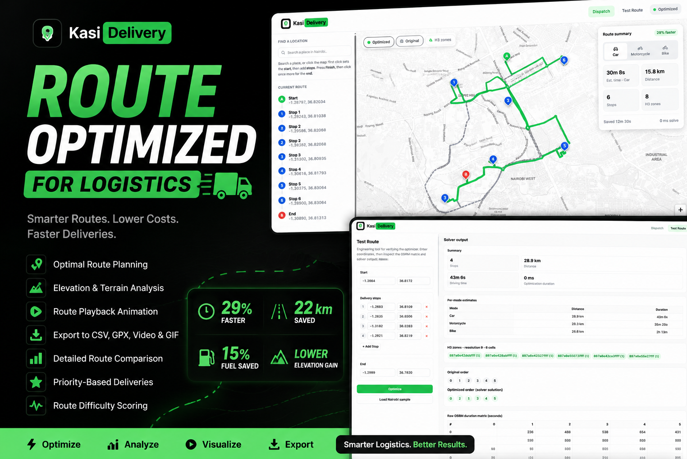
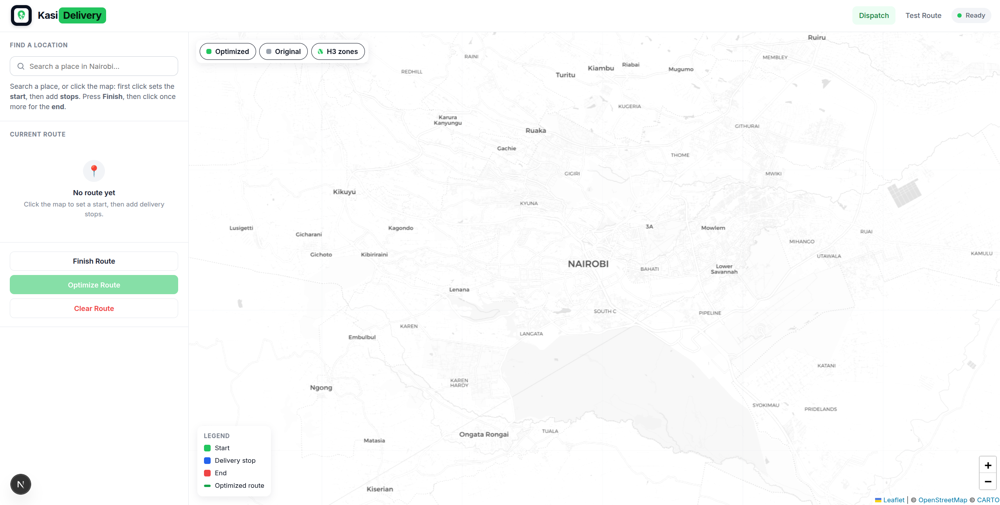
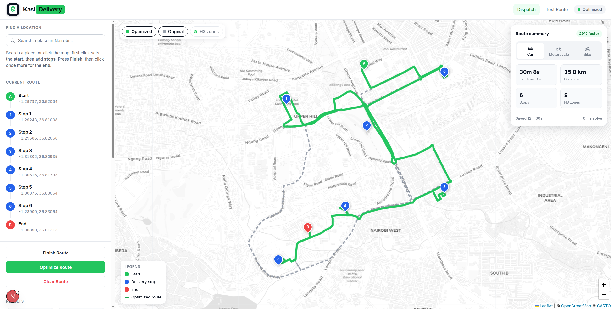
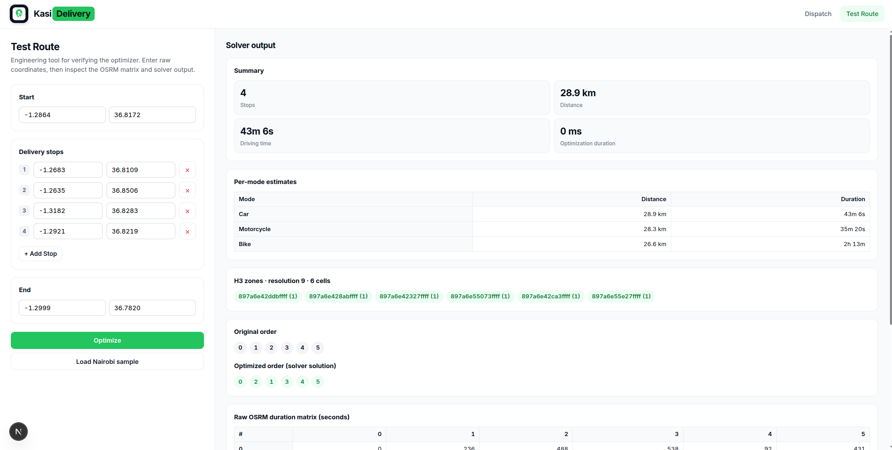
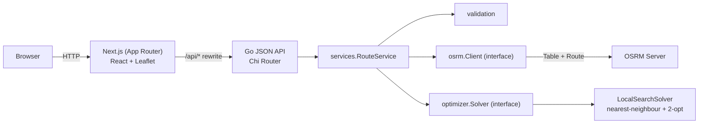
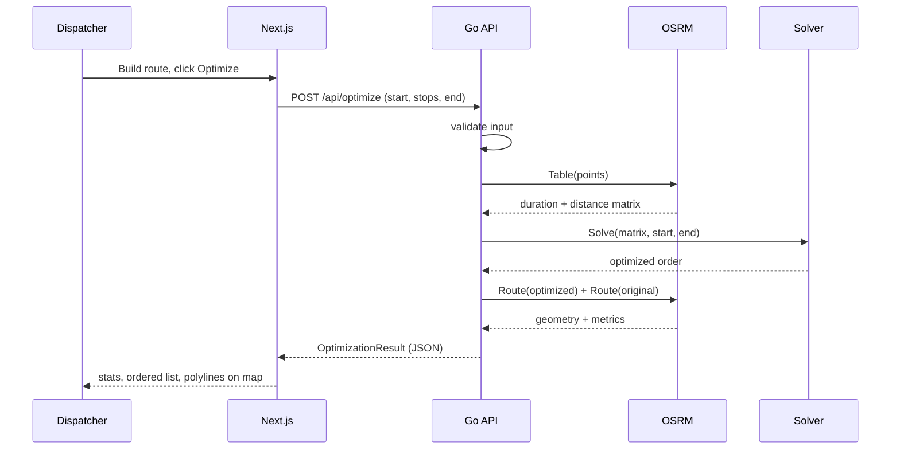

# Kasi Delivery — Route Optimizer




An internal logistics dashboard for optimizing multi-stop delivery routes using **real road travel times**. Dispatchers place a start, delivery stops, and an end on an interactive map; the service computes an order that minimizes total driving time and renders the optimized route alongside the original for comparison.

This is an operations tool, not a customer-facing product. There is no login, no signup, and no database — everything runs in-memory and both services are usable the moment they start.

The project is split into two independently deployable services:

- **`/` (Go)** — a stateless JSON API that builds the OSRM travel-time matrix and solves the routing order.
- **`frontend/` (Next.js)** — the App Router dashboard (React + Leaflet) that consumes the API.

A single command runs both together with unified logs.

---

## Demo (Screenshot)

### Dashboard screen


### Dashboard screen 2



### Test screen



## Overview

Route optimization on real road networks is a variant of the Travelling Salesman Problem with fixed endpoints. This project keeps the endpoints (start and end) pinned and reorders the interior delivery stops to minimize total driving duration.

Two external concerns are cleanly separated behind interfaces in the Go service:

- **Travel cost** comes from [OSRM](http://project-osrm.org/) via its `Table` and `Route` APIs. Straight-line distance is never used.
- **Ordering** comes from a solver that minimizes total driving time (nearest-neighbour construction refined by 2-opt local search).

The frontend is a modern Next.js dashboard. It never talks to OSRM or the solver directly — it only calls the Go API through a same-origin proxy.

---


## Installation

Requires **Go 1.23+** and **Node.js 20+**.

```bash
git clone https://github.com/abubakar508/dispatch-ops.git
cd dispatch-ops
npm install        # installs root + frontend dependencies (postinstall)
```

---

## Running Locally (single command)

```bash
npm run dev
```

This starts **both** services in one terminal with color-prefixed, interleaved logs:

- `API` (green) — the Go server on `http://localhost:8080`
- `WEB` (cyan) — the Next.js app on `http://localhost:3000`

Open **http://localhost:3000**. The frontend proxies API calls to the backend automatically. Stopping the command (`Ctrl+C`) stops both.

To run them separately:

```bash
make run-api    # go run ./cmd/server
make run-web    # next dev
```

---

## Features

- Full-screen interactive Leaflet map centered on Nairobi (zoom 12) using OpenStreetMap data (CARTO Voyager tiles).
- Click-to-build routing: first click = start, subsequent clicks = stops, `Finish Route` then a final click = end.
- Colored, draggable markers (green start, blue stops, red end); dragging updates coordinates immediately.
- Optimization objective is **minimum driving time** from the OSRM duration matrix.
- Side-by-side comparison: bold green optimized polyline vs. light gray dashed original polyline, individually toggleable.
- Results panel with stops, distance, driving time, optimization time, distance saved, time saved, route efficiency, and the ordered stop list.
- `/test-route` engineering page for verifying the optimizer with raw coordinates, exposing the raw OSRM matrix and solver output.
- Toast notifications, loading states, disabled controls while processing, and friendly validation errors.
- Production concerns on the API: structured logging, graceful shutdown, context propagation, secure headers, configuration via environment variables.

---

## System Architecture



The Next.js app proxies `/api/*` and `/healthz` to the Go service (configured in `next.config.mjs`), so the browser sees a single origin and there is no CORS in the default setup. Dependencies in the Go service point inward; `osrm` and `optimizer` are reusable packages with no knowledge of HTTP.

---

## Technology Stack

| Concern | Choice |
| --- | --- |
| Backend language | Go 1.23 |
| Router | [go-chi/chi](https://github.com/go-chi/chi) |
| Frontend | Next.js 15 (App Router), React 19, TypeScript |
| Map | Leaflet + OpenStreetMap (CARTO Voyager tiles) |
| Routing engine | OSRM `Table` and `Route` APIs |
| Optimization | Nearest-neighbour + 2-opt (OR-Tools-compatible objective) |
| Dev orchestration | `concurrently` (one command, unified logs) |
| Deployment | Docker on Render free tier (two services) |

---

## Project Structure

```
route-optimizer/
├── cmd/server/            main: wiring, HTTP server, graceful shutdown
├── internal/
│   ├── config/            environment-driven configuration
│   ├── handlers/          JSON handlers, router, CORS
│   ├── logging/           slog setup (JSON in prod, text in dev)
│   ├── models/            domain types
│   ├── optimizer/         Solver interface + local-search implementation
│   ├── osrm/              OSRM Client interface + HTTP implementation
│   ├── services/          RouteService orchestration
│   └── validation/        external input validation
├── frontend/
│   ├── app/               App Router pages (/, /test-route) + globals.css
│   ├── components/        Header, MapView, ResultsPanel, RouteSummary, Toasts
│   ├── lib/               types, api client, formatters
│   ├── public/            logo
│   ├── next.config.mjs    /api proxy to the Go service
│   └── Dockerfile
├── package.json           root: single-command dev orchestration
├── Dockerfile             Go API image
├── render.yaml            two-service Render blueprint
├── Makefile
└── go.mod
```

---

## Installation

Requires **Go 1.23+** and **Node.js 20+**.

```bash
git clone https://github.com/abubakar508/dispatch-ops.git
cd dispatch-ops
npm install        # installs root + frontend dependencies (postinstall)
```

---

## Running Locally (single command)

```bash
npm run dev
```

This starts **both** services in one terminal with color-prefixed, interleaved logs:

- `API` (green) — the Go server on `http://localhost:8080`
- `WEB` (cyan) — the Next.js app on `http://localhost:3000`

Open **http://localhost:3000**. The frontend proxies API calls to the backend automatically. Stopping the command (`Ctrl+C`) stops both.

To run them separately:

```bash
make run-api    # go run ./cmd/server
make run-web    # next dev
```

---

## Running Tests

```bash
npm test        # or: go test ./...
make test-cover # with a coverage summary
```

Go tests cover validation, the optimizer (including context cancellation and improvement guarantees), the OSRM client (via `httptest`, including timeouts and upstream failures), the route service (via a stubbed OSRM client), and the HTTP handlers (JSON responses and CORS, happy and error paths).

---

## Docker

Two images: the Go API (`./Dockerfile`, distroless static binary) and the Next.js app (`./frontend/Dockerfile`).

```bash
make docker-build           # builds the API image
docker build -t kasi-web ./frontend
```

---

## Render Deployment

`render.yaml` describes two free-tier Docker web services:

1. Push the repository to GitHub.
2. In Render, create a **Blueprint** from the repo.
3. It provisions `kasi-delivery-api` and `kasi-delivery-web`; the web service receives the API address via `BACKEND_URL` (`fromService`).
4. Deploy. The API health check path is `/healthz`.

For anything beyond light demo traffic, host your own OSRM instance and point `OSRM_BASE_URL` at it — the public demo server is rate-limited.

---

## Configuration

### Backend (Go)

| Variable | Default | Description |
| --- | --- | --- |
| `PORT` | `8080` | HTTP listen port |
| `ENVIRONMENT` | `production` | `development` uses human-readable logs |
| `LOG_LEVEL` | `info` | `debug`, `info`, `warn`, `error` |
| `OSRM_BASE_URL` | `https://router.project-osrm.org` | OSRM base URL |
| `OSRM_TIMEOUT` | `20s` | Per-request OSRM timeout |
| `OPTIMIZER_TIMEOUT` | `10s` | Reserved solver budget |
| `ALLOWED_ORIGIN` | `` (any) | CORS origin for direct browser calls (unnecessary with the proxy) |

### Frontend (Next.js)

| Variable | Default | Description |
| --- | --- | --- |
| `BACKEND_URL` | `http://localhost:8080` | Where `/api/*` is proxied (scheme optional) |

---

## Route Optimization Workflow



---

## API Endpoints

| Method | Path | Purpose |
| --- | --- | --- |
| `GET` | `/healthz` | Liveness probe (`{"status":"ok"}`) |
| `POST` | `/api/optimize` | Optimize a route; returns JSON |

`POST /api/optimize` request body:

```json
{
  "start": { "lat": -1.2864, "lng": 36.8172 },
  "stops": [
    { "lat": -1.2683, "lng": 36.8109 },
    { "lat": -1.2635, "lng": 36.8506 }
  ],
  "end": { "lat": -1.2999, "lng": 36.7820 }
}
```

The response includes the optimized and original orders, per-route metrics, savings, efficiency, optimization time, the raw OSRM matrices, and route geometry.

---

## Test Route Page

`/test-route` is a developer tool: start/end fields, a dynamic list of stops (add/remove), a "Load Nairobi sample" button, and — on optimize — the original order, optimized order, per-route metrics, optimization duration, the raw OSRM duration matrix, and the optimized geometry.

---

## Future Improvements

- Self-hosted OSRM with a Kenya OSM extract for reliable, unthrottled routing.
- Persistence (Postgres) for saved routes and driver assignments.
- Time windows and vehicle capacities (evolving from TSP toward VRP).
- Multiple vehicles and fleet-level assignment.
- Authentication and per-dispatcher workspaces.

---

## Design Decisions

- **Two services, one origin.** The Go API is stateless and reusable; the Next.js app owns presentation and proxies to it, avoiding CORS while keeping the layers independently deployable.
- **Interfaces at the boundaries only.** `osrm.Client` and `optimizer.Solver` are interfaces because they have real alternate implementations. Internal types stay concrete to avoid speculative abstraction.
- **In-memory by design.** No database in v1 keeps deployment trivial; persistence is an additive change behind the service layer.
- **Errors are wrapped and classified.** The domain returns wrapped sentinel errors; the handler maps them with `errors.Is` to friendly messages and correct HTTP status codes, surfaced as toasts in the UI.
- **Context everywhere.** Every outbound call and the solver accept `context.Context`, so request timeouts and shutdown cancel work promptly.

## Why Google OR-Tools

The optimization objective and problem shape mirror how one would model this in Google OR-Tools' routing library: a duration matrix as the arc cost, fixed start/end nodes, and interior stops to be reordered for minimum total time. OR-Tools has no native Go binding — it requires CGO or a separate service, both unreliable on Render's free tier. This project implements the same objective natively in Go behind the `optimizer.Solver` interface, so an OR-Tools-backed solver can be dropped in without touching the service, handlers, or frontend.

## Why OSRM

OSRM provides exactly the two operations this problem needs: a `Table` service that returns an all-pairs travel-time matrix in one request, and a `Route` service that returns drivable geometry and metrics. It is open source, self-hostable, and returns real road-network durations rather than straight-line estimates. The `osrm.Client` interface isolates this dependency so the provider can be swapped or mocked freely.

---

## License

MIT. See [LICENSE](LICENSE).
